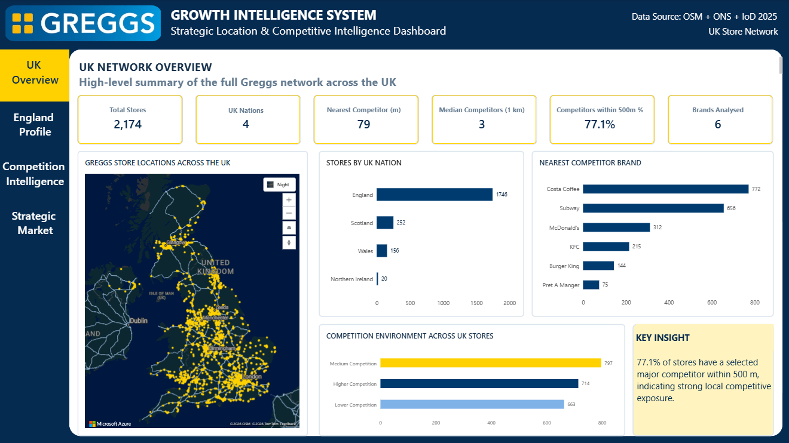
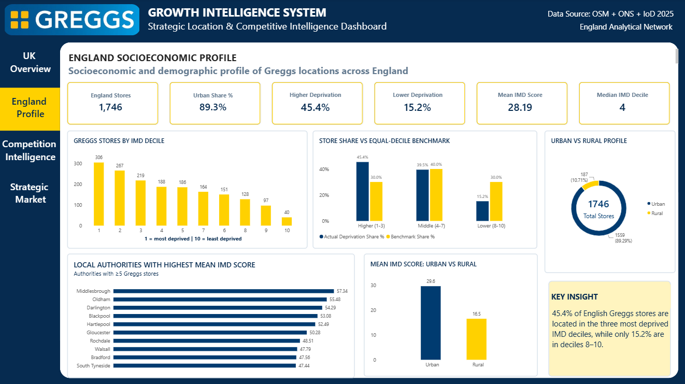
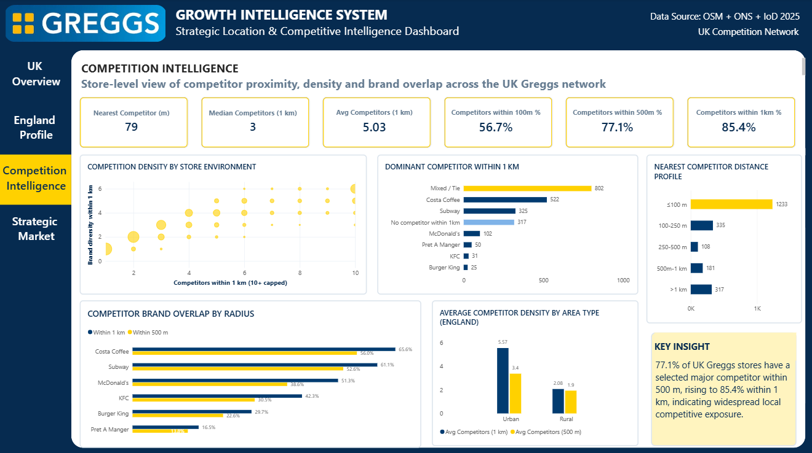
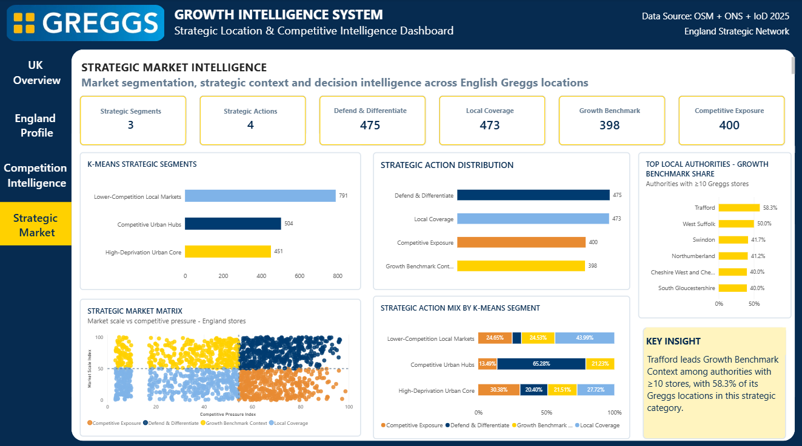

# Greggs Growth Intelligence System

An end-to-end **geospatial data science and business intelligence project** that explores the UK Greggs store network, local competitive intensity, socioeconomic context and strategic market structure using public data.

The project combines **OpenStreetMap**, **ONS postcode geography**, **Indices of Deprivation 2025**, statistical analysis, K-Means clustering and Power BI to turn raw location data into an interpretable market-intelligence system.

> **Independent portfolio project:** This work was created for analytical and educational purposes. It is not an official Greggs plc project and is not endorsed by Greggs plc.

## Project at a Glance

- **2,174 Greggs stores** mapped across the UK
- **7,815 cleaned competitor locations** across six selected brands
- **1,746 England stores** enriched with socioeconomic and strategic features
- **97-field Power BI master dataset** for reporting and analysis
- Statistical testing of deprivation and competition patterns
- **3 stable K-Means market segments**
- **4 strategic market contexts** translated into decision-oriented actions
- Four-page **Power BI Growth Intelligence Dashboard**

## Business Questions

This project was designed to answer five practical questions:

1. Where is the Greggs store network concentrated across the UK?
2. How close are selected major food-to-go and QSR competitors to Greggs stores?
3. What socioeconomic characteristics surround Greggs locations in England?
4. Can stores be grouped into meaningful market segments using unsupervised learning?
5. How can market scale and competitive pressure be translated into interpretable strategic contexts?

## Data Sources

| Source | Role in the project |
|---|---|
| OpenStreetMap | Greggs and selected competitor locations |
| ONS Postcode Directory, May 2026 | Postcode coordinates, LSOA geography and local-authority mapping |
| English Indices of Deprivation 2025 | IMD and domain-level socioeconomic indicators for England |

Selected competitor brands analysed:

- Costa Coffee
- Subway
- McDonald's
- KFC
- Burger King
- Pret A Manger

## Analytical Workflow

### 1. Store and competitor data preparation

Greggs and competitor locations were collected from OpenStreetMap, cleaned, deduplicated and validated. Suspicious non-store objects and explicit brand conflicts were removed before spatial analysis.

### 2. Geographic and socioeconomic enrichment

Greggs locations were matched to the ONS Postcode Directory and then linked to 2025 English deprivation data. Stores without an OSM postcode were spatially recovered using the nearest postcode centroid.

### 3. Spatial competition engineering

For every Greggs store, the pipeline calculates features such as:

- nearest selected competitor and distance
- competitors within 500 m and 1 km
- competitor-brand diversity
- brand-specific proximity
- dominant competitor within 1 km
- competition-environment classification

### 4. Exploratory and statistical analysis

The analysis examines:

- UK network distribution
- deprivation profile of English Greggs stores
- urban vs rural differences
- competitor proximity and density
- relationships between deprivation and competition

Statistical methods include Welch's t-test, Mann-Whitney U, Spearman correlation, Kruskal-Wallis testing and effect-size reporting.

### 5. K-Means market segmentation

K-Means clustering was applied to three non-redundant features:

- IMD score
- local population
- competitors within 1 km

A three-cluster solution provided the strongest combination of statistical quality, stability and business interpretability.

Final segments:

| Segment | Stores | Interpretation |
|---|---:|---|
| Lower-Competition Local Markets | 791 | Lower-pressure local markets with relatively limited competitor density |
| Competitive Urban Hubs | 504 | Larger urban markets with high competitive pressure |
| High-Deprivation Urban Core | 451 | Highly urban locations with substantially higher deprivation context |

Cluster stability was tested across 30 random seeds and remained highly consistent.

### 6. Strategic market framework

Three 0-100 analytical indices were created:

- **Market Scale Index**
- **Competitive Pressure Index**
- **Deprivation Context Index**

Market Scale and Competitive Pressure were split at their median thresholds to create four strategic contexts:

| Strategic context | Stores | Interpretation |
|---|---:|---|
| Defend & Differentiate | 475 | Larger markets with high competitive pressure |
| Local Coverage | 473 | Smaller/local markets with lower competitive pressure |
| Competitive Exposure | 400 | Smaller markets with comparatively high competitive pressure |
| Growth Benchmark Context | 398 | Larger markets with comparatively lower competitive pressure |

These labels are **analytical contexts rather than sales or profit forecasts**.

## Key Findings

- **77.1%** of UK Greggs stores have a selected major competitor within **500 m**.
- **85.4%** have a selected major competitor within **1 km**.
- The median nearest selected competitor is approximately **79 m** across the UK network.
- Costa Coffee and Subway show the highest spatial overlap with Greggs among the six selected competitor brands.
- **45.4%** of English Greggs stores are located in IMD deciles **1-3**, compared with **15.2%** in deciles **8-10**.
- Urban English locations have a substantially higher mean IMD score than rural locations.
- Urban stores also experience denser local competition than rural stores.
- The largest K-Means segment is **Lower-Competition Local Markets** with **791 stores**.
- Among local authorities with at least 10 Greggs stores, **Trafford** has the highest Growth Benchmark Context share at **58.3% (7 of 12 stores)**.

## Power BI Dashboard

The final reporting layer is a four-page Power BI dashboard built from the validated master dataset.

### 1. UK Network Overview

Shows the full UK store footprint, country distribution, nearest competitor brands and overall competition environment.



### 2. England Socioeconomic Profile

Explores deprivation, urban/rural context, local-authority patterns and representation across IMD groups.



### 3. Competition Intelligence

Analyses competitor density, proximity bands, dominant competitors, brand overlap and urban/rural competition intensity.



### 4. Strategic Market Intelligence

Connects K-Means segmentation with the strategic market matrix, action distribution, segment-level action mix and local-authority benchmark context.



The Power BI file is available at:

`powerbi/Greggs_Growth_Intelligence_System.pbix`

## Repository Structure

```text
greggs-growth-intelligence-system/
│
├── data/
│   └── final/
│       ├── POWERBI_greggs_growth_intelligence_master.csv
│       └── competitor_stores_final.csv
│
├── notebooks/
│   └── Greggs_Growth_Intelligence_System.ipynb
│
├── outputs/
│   ├── dashboard/
│   │   ├── 01_uk_network_overview.png
│   │   ├── 02_england_socioeconomic_profile.png
│   │   ├── 03_competition_intelligence.png
│   │   └── 04_strategic_market_intelligence.png
│   ├── figures/
│   └── tables/
│
├── powerbi/
│   └── Greggs_Growth_Intelligence_System.pbix
│
├── README.md
├── requirements.txt
└── .gitignore
```

## Technology Stack

**Data & analysis**

- Python
- pandas
- NumPy
- SciPy
- scikit-learn
- GeoPandas / geospatial processing

**Data sources and geography**

- OpenStreetMap / OSMnx
- ONS Postcode Directory
- English Indices of Deprivation 2025

**Visualisation and reporting**

- Matplotlib
- Power BI
- DAX

**Development**

- Google Colab / Jupyter
- GitHub

## Reproducibility

Install the Python dependencies with:

```bash
pip install -r requirements.txt
```

Then open the notebook in `notebooks/` and run the workflow in sequence.

The repository is intentionally optimised for portfolio review. Large raw source files and many intermediate pipeline artefacts are excluded, while the curated final datasets, analysis outputs, notebook and dashboard are retained.

The notebook contains snapshot/reuse logic so previously collected OpenStreetMap data can be reused instead of being re-queried unnecessarily.

## Data Quality and Validation

The final Power BI master dataset passed a dedicated quality audit covering:

- unique store identifiers
- complete coordinates
- plausible UK geographic bounds
- UK nation totals
- complete England analytical fields
- valid IMD deciles
- England-only strategic scope
- consistency between 500 m and 1 km competition features
- strategic-action counts
- required Power BI fields
- successful CSV reload validation

## Limitations

- OpenStreetMap is community-maintained and may contain missing, delayed or inconsistent records.
- Competitor analysis is limited to six selected brands and is not an exhaustive representation of every local competitor.
- English deprivation data applies only to England; Scotland, Wales and Northern Ireland are retained for UK network and competition analysis but not socioeconomic or strategic modelling.
- The project does not use internal Greggs sales, revenue, margin, footfall, property-cost or customer-level data.
- Strategic segments and actions are descriptive analytical frameworks, not validated predictions of store performance or future expansion success.
- Statistical associations should not be interpreted as causal relationships.

## What This Project Demonstrates

This project demonstrates an end-to-end data science workflow covering:

**data acquisition → cleaning → geospatial engineering → official-data enrichment → EDA → statistical inference → unsupervised machine learning → model stability testing → business interpretation → Power BI communication**

The emphasis is not only on producing models, but on translating analytical outputs into clear, decision-oriented business intelligence.

## Author

**Pranav Panneerselvam**  
MSc Data Science, Newcastle University  
GitHub: [Pranav-P108](https://github.com/Pranav-P108)

---

*Independent portfolio analysis using publicly available data. Greggs and other brand names are used only to describe the subjects of the analysis.*
