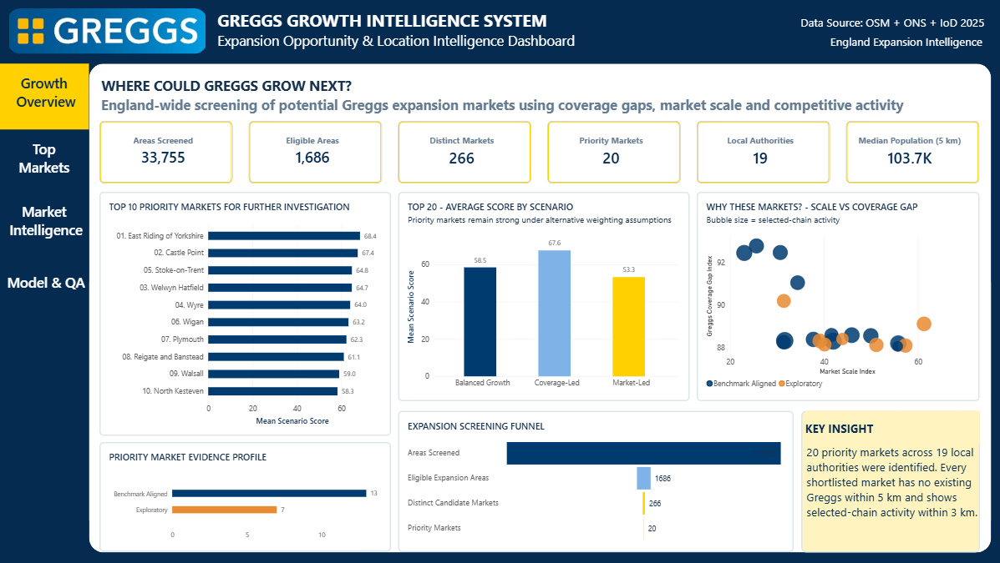
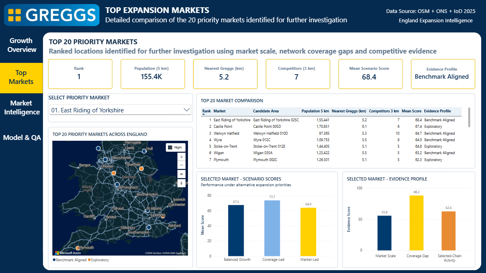
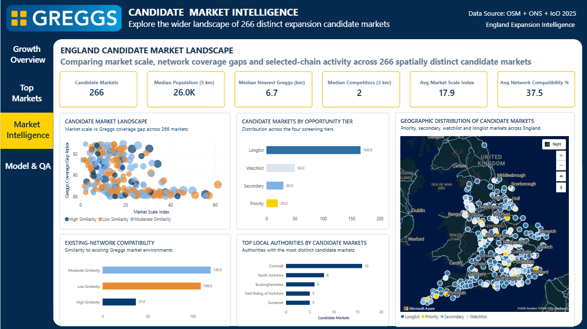
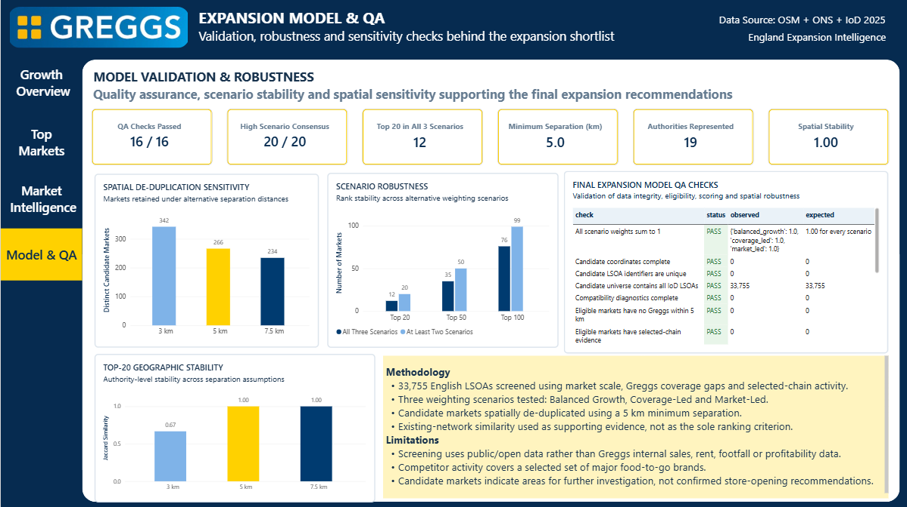

# Greggs Growth Intelligence System

### Expansion Opportunity & Location Intelligence for the Greggs UK Store Network

An end-to-end geospatial data science and business intelligence project designed to explore a practical question:

> **Where could Greggs investigate opening new stores in England?**

The project combines Greggs' existing store network, selected food-to-go competitors, population, deprivation, rural/urban context and spatial accessibility to screen potential expansion markets across England.

Rather than simply ranking locations using one score, the system uses multiple strategic scenarios, spatial de-duplication, existing-network compatibility and robustness testing to produce a shortlist of markets for further investigation.

> **Independent portfolio project. This analysis is not affiliated with, commissioned by, or based on internal data from Greggs plc.**

---

## Project Overview

The project began by analysing the existing Greggs network and its competitive and socioeconomic context.

It was then extended into an expansion-intelligence system that screens England at LSOA level and progressively narrows the candidate universe.

### Expansion Screening Pipeline

**33,755 English LSOAs screened**

↓  

**1,686 eligible expansion areas**

↓  

**266 spatially distinct candidate markets**

↓  

**20 priority markets**

↓  

**19 local authorities represented**

The final expansion model passed:

**16 / 16 QA checks**

---

## Business Question

The project aims to support questions such as:

- Where are meaningful gaps in the current Greggs network?
- Which areas combine population scale with limited nearby Greggs coverage?
- Where does activity from selected food-to-go competitors suggest an established commercial market?
- Which candidate markets remain attractive under different strategic assumptions?
- Which opportunities resemble market environments where Greggs already operates?
- How sensitive is the shortlist to spatial and modelling assumptions?

The output should be interpreted as a **market-screening and decision-support framework**, not as a confirmed store-opening recommendation.

---

## Data Sources

The analysis integrates public and open datasets including:

### OpenStreetMap
Used to identify:

- Greggs store locations
- Costa Coffee
- Subway
- McDonald's
- KFC
- Burger King
- Pret A Manger

The selected competitor dataset contains approximately **7,815 locations**.

### ONS Postcode Directory

Used for geographic linkage, coordinates and administrative geography.

### English Indices of Deprivation 2025

Used for England-specific socioeconomic context.

### Population and Rural / Urban Classification

Used to estimate local market scale and settlement characteristics.

---

## Existing Network Baseline

Before identifying expansion candidates, the existing Greggs network was analysed to understand the environments in which the company currently operates.

The cleaned network contains:

- **2,174 Greggs stores across the UK**
- **1,746 stores in England**
- **252 stores in Scotland**
- **156 stores in Wales**
- **20 stores in Northern Ireland**

Selected competitor proximity was also calculated spatially.

Key network findings included:

- Median nearest selected competitor distance: **79 m**
- **77.1%** of Greggs stores have a selected major competitor within **500 m**
- **85.4%** have one within **1 km**

This existing-network analysis provides context for the later expansion screening.

---

## Expansion Methodology

### 1. Candidate Market Universe

All **33,755 English LSOAs** were evaluated as potential market areas.

Each candidate was enriched with:

- population
- deprivation
- rural / urban classification
- Greggs network proximity
- selected competitor activity
- local authority
- geographic coordinates

---

### 2. Greggs Network Coverage

Spatial calculations measured:

- nearest existing Greggs distance
- Greggs stores within 1 km
- Greggs stores within 3 km
- Greggs stores within 5 km

A major eligibility condition required candidate expansion areas to have:

> **No existing Greggs within 5 km**

This produced a meaningful network-gap universe rather than recommending areas already strongly covered.

---

### 3. Selected-Chain Activity

The six selected competitor brands were analysed around each candidate location.

Features include:

- competitors within 1 km
- competitors within 3 km
- competitors within 5 km
- selected-brand diversity
- nearest selected competitor
- competitor activity index

Competitor presence is treated as **market evidence**, not proof of demand or profitability.

---

### 4. Market Scale

Local population catchments were estimated around candidate areas.

Examples include:

- population within 3 km
- population within 5 km
- number of surrounding LSOAs

These were transformed into a standardised:

**Candidate Market Scale Index**

---

### 5. Standardised Screening Indicators

Three main indicators were constructed on a 0–100 scale:

- **Market Scale Index**
- **Greggs Coverage Gap Index**
- **Selected-Chain Activity Index**

These form the core evidence used for expansion screening.

---

## Multi-Scenario Opportunity Screening

A single weighting scheme can produce fragile rankings.

To reduce dependence on one strategic assumption, three scenarios were tested:

### Balanced Growth

Balances:

- market scale
- Greggs coverage gap
- selected-chain activity

### Coverage-Led

Places greater emphasis on locations with stronger network coverage gaps.

### Market-Led

Places greater emphasis on market size and commercial activity.

---

## Scenario Robustness

The candidate rankings were compared across all three scenarios.

Among the:

| Ranking Group | In All 3 Scenarios | In At Least 2 |
|---|---:|---:|
| Top 20 | 12 | 20 |
| Top 50 | 35 | 50 |
| Top 100 | 76 | 99 |

This suggests that the strongest candidate markets are not dependent on a single weighting configuration.

---

## Spatial De-duplication

Neighbouring LSOAs can represent the same wider commercial market.

To avoid recommending multiple nearby areas as separate opportunities, spatial de-duplication was applied.

The primary assumption uses a:

**5 km minimum separation**

Sensitivity testing produced:

| Minimum Separation | Distinct Markets Retained |
|---|---:|
| 3 km | 342 |
| 5 km | 266 |
| 7.5 km | 234 |

The final system therefore uses:

**266 spatially distinct candidate markets**

---

## Existing-Network Compatibility

Candidate markets were compared with the characteristics of existing English Greggs stores.

Existing-store clustering used:

- deprivation
- population
- competitor activity

Three existing-network market segments were identified:

- Competitive Urban Hubs
- Lower-Competition Local Markets
- High-Deprivation Urban Core

Candidate markets were then assigned an:

**Existing-Network Compatibility Score**

This is used as supporting evidence rather than as the sole ranking criterion.

---

## Candidate Market Tiers

The 266 spatially distinct candidate markets are organised into four screening tiers:

- **Priority**
- **Secondary**
- **Watchlist**
- **Longlist**

The final Priority tier contains:

**20 markets across 19 local authorities**

---

## Top Priority Markets

The final shortlist begins with markets including:

1. East Riding of Yorkshire
2. Castle Point
3. Welwyn Hatfield
4. Wyre
5. Stoke-on-Trent
6. Wigan
7. Plymouth
8. Reigate and Banstead
9. Walsall
10. North Kesteven

The dashboard allows individual markets to be selected and inspected using:

- population within 5 km
- nearest Greggs distance
- selected competitors within 3 km
- scenario scores
- evidence profile
- market scale
- coverage gap
- selected-chain activity

---

## Model Quality Assurance

A dedicated QA framework tests the expansion pipeline.

The final model achieved:

> **16 / 16 QA checks passed**

Checks include:

- candidate universe completeness
- unique LSOA identifiers
- coordinate completeness
- eligibility-rule compliance
- competitor evidence completeness
- scenario-weight validation
- scenario-score completeness
- spatial separation compliance
- shortlist size
- shortlist uniqueness
- geographic diversity
- scenario consensus
- network-compatibility diagnostics

---

## Geographic Stability

The geographic composition of the final shortlist was also tested under alternative spatial assumptions.

Authority-level Jaccard similarity:

| Separation Assumption | Similarity vs 5 km |
|---|---:|
| 3 km | 0.67 |
| 5 km | 1.00 |
| 7.5 km | 1.00 |

The shortlist therefore shows strong geographic stability around the primary spatial assumption.

---

# Power BI Dashboard

The final Power BI report contains four decision-intelligence pages.

## 1. Growth Opportunity Overview

Provides an executive view of the entire expansion funnel:

- 33,755 areas screened
- 1,686 eligible areas
- 266 distinct markets
- 20 priority markets
- scenario comparison
- market-scale vs coverage-gap analysis



---

## 2. Top Expansion Markets

Interactive analysis of the final 20 markets including:

- selectable priority market
- Top 20 comparison table
- England map
- scenario-score breakdown
- evidence-profile breakdown



---

## 3. Candidate Market Intelligence

Explores the full universe of 266 candidate markets.

Includes:

- market scale vs coverage gap
- opportunity-tier distribution
- geographic candidate-market map
- existing-network compatibility
- local authorities with multiple candidate markets



---

## 4. Expansion Model & QA

Provides transparency around model robustness.

Includes:

- 16/16 QA status
- spatial sensitivity
- scenario robustness
- geographic stability
- QA inspection table
- methodology and limitations



---

## Technology Stack

### Data Analysis
- Python
- Pandas
- NumPy
- SciPy
- scikit-learn

### Geospatial Analysis
- OpenStreetMap
- geographic coordinates
- distance calculations
- spatial-radius analysis
- spatial market de-duplication

### Statistical Analysis
- Welch's t-test
- Mann-Whitney U
- Spearman correlation
- Kruskal-Wallis
- effect-size analysis

### Machine Learning
- K-Means clustering
- clustering diagnostics
- stability testing
- existing-network similarity analysis

### Business Intelligence
- Power BI
- DAX
- interactive filtering
- Azure Maps
- executive dashboard design

### Development
- Google Colab
- Jupyter Notebook
- Git
- GitHub

---

## Repository Structure
```text
greggs-growth-intelligence-system/
│
├── data/
│   └── final/
│       ├── POWERBI_greggs_growth_intelligence_master.csv
│       └── competitor_stores_final.csv
│
├── notebooks/
│   └── main analysis notebook
│
├── exports/
│   ├── POWERBI_existing_and_candidate_map.csv
│   ├── POWERBI_expansion_candidate_markets.csv
│   ├── POWERBI_expansion_kpis.csv
│   ├── POWERBI_expansion_model_qa.csv
│   ├── POWERBI_scenario_definitions.csv
│   └── POWERBI_top20_expansion_markets.csv
│
├── outputs/
│   ├── dashboard/
│   │   ├── 01_growth_opportunity_overview.png
│   │   ├── 02_top_expansion_markets.png
│   │   ├── 03_candidate_market_intelligence.png
│   │   └── 04_expansion_model_qa.png
│   │
│   ├── archive/
│   │   └── original dashboard screenshots
│   │
│   ├── figures/
│   └── tables/
│
├── powerbi/
│   ├── Greggs_Growth_Intelligence_System.pbix
│   └── archive/
│       └── original Power BI version
│
├── .gitignore
├── README.md
└── requirements.txt
```

## Key Analytical Takeaways

The project demonstrates that expansion screening can be treated as a structured decision-intelligence problem rather than simply identifying locations with large populations.

The final framework combines:

**market size + existing-network gaps + competitor activity + scenario robustness + spatial independence + network compatibility**

to progressively reduce more than 33,000 geographic areas into a manageable shortlist for further commercial investigation.

The strongest result is not simply the identification of 20 locations.

It is the creation of a **transparent and auditable process explaining why those markets survived the screening process.**

---

## Limitations

This project intentionally avoids presenting the shortlisted markets as confirmed expansion recommendations.

Important limitations include:

- OpenStreetMap is community-maintained and is not an official Greggs store register.
- Only a selected group of major food-to-go competitors is included.
- The expansion model does not contain Greggs internal sales or transaction data.
- Rent, property availability, site size and lease costs are not available.
- Footfall and transport-flow data are not included.
- Local profitability and cannibalisation cannot be directly measured.
- English deprivation measures are not directly transferable to the rest of the UK.
- Competitor proximity does not prove competitive impact or commercial demand.
- Candidate-market scores are analytical screening tools rather than revenue or profit forecasts.

A real commercial site-selection process would combine this framework with internal performance data, property economics, pedestrian and transport flows, customer behaviour and operational feasibility.

---

## Future Development

Potential extensions include:

- store-level sales and transaction data
- pedestrian footfall
- commuting and transport accessibility
- commercial rent
- property availability
- drive-time catchments
- demographic segmentation
- delivery-platform demand
- cannibalisation modelling
- supervised site-performance modelling
- optimisation of multi-store expansion portfolios

---

## Project Purpose

This project was developed as an independent data science portfolio project demonstrating:

- geospatial analytics
- statistical analysis
- machine learning
- business intelligence
- scenario modelling
- data quality assurance
- location intelligence
- decision-focused communication

The emphasis is not only on producing analysis, but on converting multiple public datasets into a transparent business decision-support system.

---

## Author

**Pranav Panneerselvam**  
MSc Data Science — Newcastle University

Interested in Data Science, Data Analytics, Business Intelligence and decision-intelligence opportunities in the UK.
